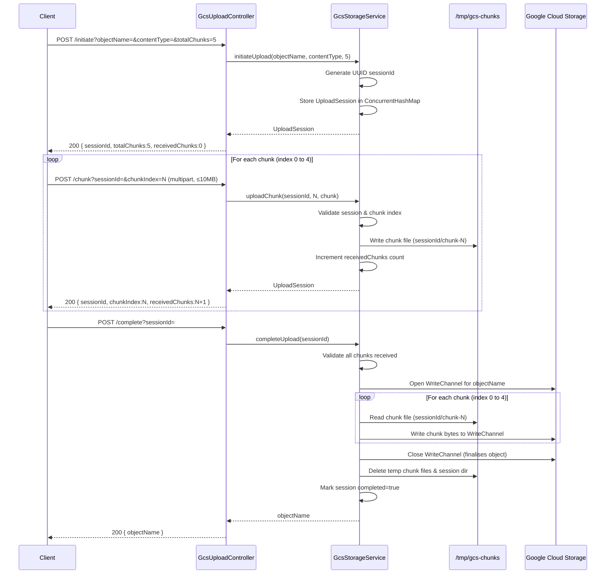
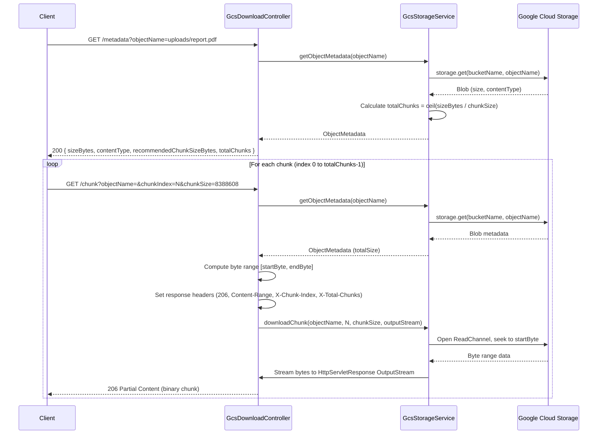

# GCS Chunked Upload / Download Service

## Overview

This service provides a Spring Boot 3.2 REST API for uploading and downloading large files to and from **Google Cloud Storage (GCS)** using chunked transfer. It is designed to operate behind an **Apigee API gateway**, which enforces a 10 MB per-request payload limit.

All operations are authenticated via **Application Default Credentials (ADC)** — no signed URLs are generated. Access is governed entirely by IAM permissions on the GCS bucket.

| Setting | Value |
|---|---|
| GCP Project | `11111111` |
| Bucket | `vsi-unscanned-uscentral1` |
| Bucket region | `us-central1` |
| Default chunk size | 8 MB (configurable) |
| Apigee payload limit | 10 MB per request |
| Server port | `8080` |

---

## Architecture

```
┌──────────┐   HTTP (≤10 MB/req)   ┌─────────────────────┐   ADC   ┌─────────────────────┐
│  Client  │ ─────────────────────▶│  Spring Boot Service │ ───────▶│  Google Cloud       │
│          │ ◀─────────────────────│  (port 8080)         │         │  Storage            │
└──────────┘                       └─────────────────────┘         │  vsi-unscanned-     │
                                           │                        │  uscentral1         │
                                    /tmp/gcs-chunks/                └─────────────────────┘
                                    (chunk assembly)
```

### Key Design Decisions

- **No signed URLs** — all traffic flows through the authenticated `Storage` client; IAM on the bucket controls access.
- **Chunked uploads** — the client splits the file into chunks (≤ 10 MB each), sends them individually, then triggers final assembly into GCS via a `WriteChannel`.
- **Chunked downloads** — the server reads byte ranges from GCS using a `ReadChannel` and streams them directly to the HTTP response. No full-file buffering in memory.
- **Session storage** — upload sessions are held in a `ConcurrentHashMap`. For HA deployments this should be replaced with Redis or a database.
- **Integer overflow guard** — chunk-count calculations for very large objects use `long` arithmetic with an explicit `Integer.MAX_VALUE` cap.

---

## Project Structure

```
src/
├── main/
│   ├── java/com/vsi/poc/gcs/
│   │   ├── GcsApplication.java              # Spring Boot entry point
│   │   ├── config/
│   │   │   └── GcsConfig.java               # Storage bean (ADC)
│   │   ├── controller/
│   │   │   ├── GcsUploadController.java     # Upload endpoints
│   │   │   └── GcsDownloadController.java   # Download endpoints
│   │   ├── service/
│   │   │   └── GcsStorageService.java       # GCS interaction logic
│   │   ├── model/
│   │   │   ├── UploadSession.java           # Upload session state
│   │   │   └── ObjectMetadata.java          # GCS object metadata
│   │   └── exception/
│   │       ├── GcsException.java            # GCS runtime exception
│   │       ├── ResourceNotFoundException.java
│   │       └── GlobalExceptionHandler.java  # @RestControllerAdvice
│   └── resources/
│       └── application.yml
└── test/
    └── java/com/vsi/poc/gcs/
        └── GcsStorageServiceTest.java
```

---

## Upload API

### 3-Step Protocol

#### Step 1 — Initiate

```
POST /api/files/upload/initiate
  ?objectName=uploads/report.pdf
  &contentType=application/pdf
  &totalChunks=5
```

Response `200 OK`:
```json
{
  "sessionId": "3fa85f64-5717-4562-b3fc-2c963f66afa6",
  "objectName": "uploads/report.pdf",
  "contentType": "application/pdf",
  "totalChunks": 5,
  "receivedChunks": 0,
  "completed": false
}
```

#### Step 2 — Upload Chunk (repeat for each chunk)

```
POST /api/files/upload/chunk
  ?sessionId=3fa85f64-5717-4562-b3fc-2c963f66afa6
  &chunkIndex=0
Content-Type: multipart/form-data

field name: "chunk"  (binary data, ≤ 10 MB)
```

Response `200 OK`:
```json
{
  "sessionId": "3fa85f64-5717-4562-b3fc-2c963f66afa6",
  "chunkIndex": 0,
  "receivedChunks": 1,
  "totalChunks": 5
}
```

#### Step 3 — Complete

```
POST /api/files/upload/complete
  ?sessionId=3fa85f64-5717-4562-b3fc-2c963f66afa6
```

Response `200 OK`:
```json
{
  "objectName": "uploads/report.pdf"
}
```

#### Optional — Session Status

```
GET /api/files/upload/status/{sessionId}
```

Response `200 OK`: returns the full `UploadSession` object.

---

## Download API

### 2-Step Protocol

#### Step 1 — Get Metadata

```
GET /api/files/download/metadata
  ?objectName=uploads/report.pdf
```

Response `200 OK`:
```json
{
  "objectName": "uploads/report.pdf",
  "sizeBytes": 41943040,
  "contentType": "application/pdf",
  "recommendedChunkSizeBytes": 8388608,
  "totalChunks": 5
}
```

#### Step 2 — Download Chunk (repeat for each chunk)

```
GET /api/files/download/chunk
  ?objectName=uploads/report.pdf
  &chunkIndex=0
  &chunkSize=8388608   (optional, defaults to 8 MB)
```

Response `206 Partial Content`:
```
Content-Type: application/pdf
Content-Range: bytes 0-8388607/41943040
Content-Disposition: attachment; filename="report.pdf"
X-Chunk-Index: 0
X-Total-Chunks: 5

[binary chunk data]
```

---

## Sequence Diagrams

### Upload Flow



---

### Download Flow



---

## Configuration Reference

`src/main/resources/application.yml`:

| Property | Default | Description |
|---|---|---|
| `gcs.project-id` | `11111111` | GCP project ID |
| `gcs.bucket-name` | `vsi-unscanned-uscentral1` | Target GCS bucket |
| `gcs.download-chunk-size-bytes` | `8388608` (8 MB) | Recommended chunk size for downloads |
| `gcs.temp-dir` | `/tmp/gcs-chunks` | Local directory for temporary upload chunks |
| `spring.servlet.multipart.max-file-size` | `10MB` | Maximum size of a single chunk upload |
| `spring.servlet.multipart.max-request-size` | `10MB` | Maximum total multipart request size |
| `server.port` | `8080` | HTTP server port |

---

## Error Handling

All errors are returned as structured JSON via `GlobalExceptionHandler` (`@RestControllerAdvice`):

```json
{
  "timestamp": "2024-03-01T10:00:00Z",
  "status": 404,
  "error": "Not Found",
  "message": "Upload session abc123 not found"
}
```

| Scenario | HTTP Status |
|---|---|
| Upload session or GCS object not found | `404 Not Found` |
| Invalid arguments (e.g. bad chunk index) | `400 Bad Request` |
| Missing required query parameter | `400 Bad Request` |
| Chunk exceeds 10 MB limit | `413 Payload Too Large` |
| GCS operation failure | `500 Internal Server Error` |
| Any other unexpected error | `500 Internal Server Error` |

---

## Getting Started

### Prerequisites

- Java 17+
- Maven 3.8+
- Google Cloud SDK (`gcloud`) with Application Default Credentials configured, **or** a GCP environment (GKE, Cloud Run, Compute Engine) with a service account attached

### Local Development

```bash
# Authenticate locally
gcloud auth application-default login

# Build and run
mvn spring-boot:run
```

### Build

```bash
mvn clean package
java -jar target/gcs-service-1.0.0-SNAPSHOT.jar
```

### Testing

```bash
mvn test
```

Unit tests in `GcsStorageServiceTest` cover:
- Upload session initiation (valid and invalid `totalChunks`)
- Chunk upload (increment counter, out-of-range index, unknown session)
- Upload completion error paths (missing chunks, unknown session)
- Session status retrieval
